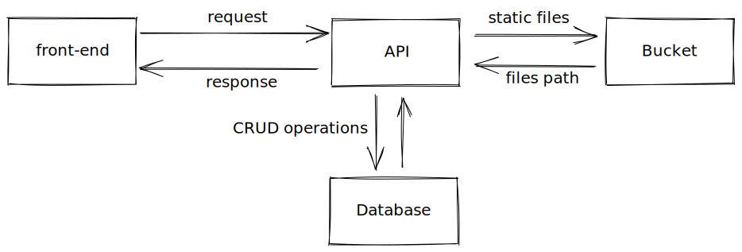

## Support Project API

This project is an personal project focused in learning. My objective is practice basic principles of build a simple REST API using Node.js. 

I called this project as "Support" because my idea is develop a system where users are enabled to support and sponsor any social project.

### Basic Business Rule

So, basicaly the user can be able to create any project what we called by campaign. Once campaign has been created, they are visible in on website. After that the visitors can be able to sponsor any project.

### Architecture

The following diagram show how i thought an architecture to apply 3 core concepts, they are: TDD, Cloud Storage and Migrations.

### Technologies

##### TDD
> Jest
> Supertest
##### API
> Node.js
> Express
> Typescript
##### BUCKET
> Amazon S3
##### Database
> PostgreSQL (Docker Container)